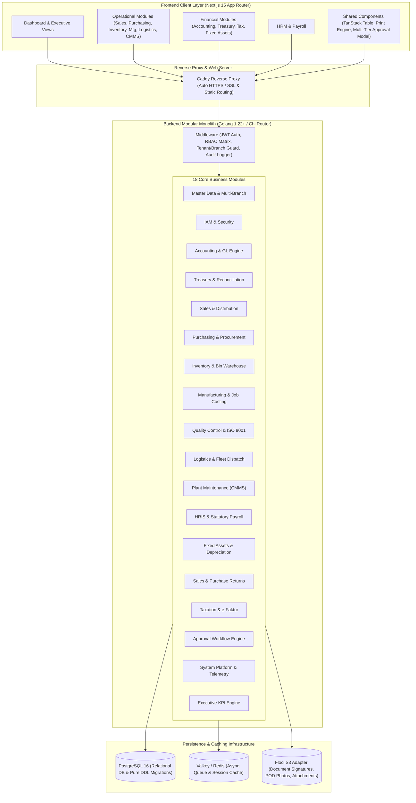
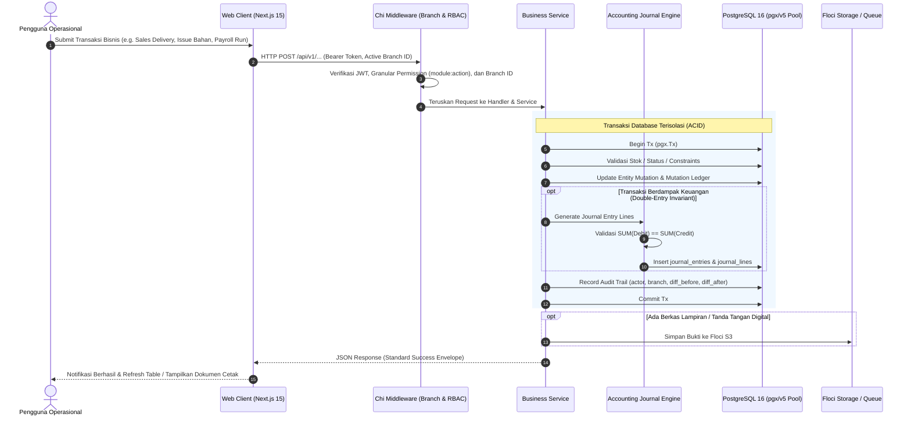

# 00. System Architecture Overview & Global Design

## 1. Ikhtisar Arsitektur Sistem

Enterprise ERP dibangun menggunakan arsitektur **Modular Monolith** dengan prinsip *Clean Architecture* di sisi Backend (Golang) dan *Next.js 15 App Router* di sisi Frontend.

---

## 2. Global Data Pipeline & Invariant Enforcement

