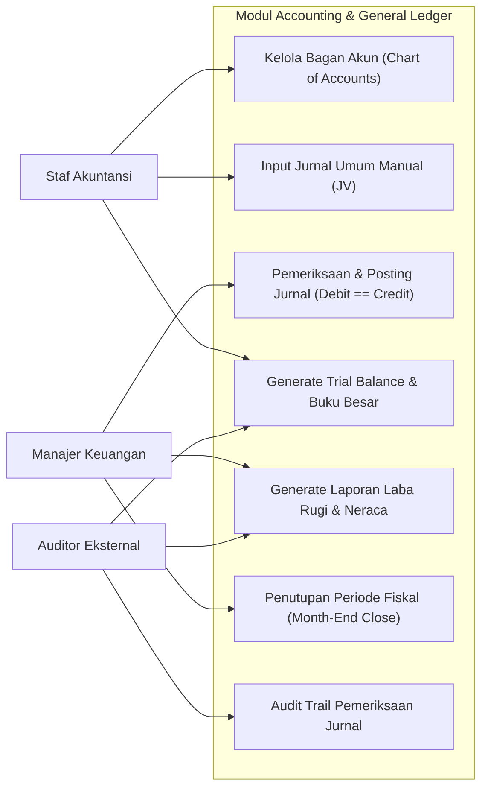
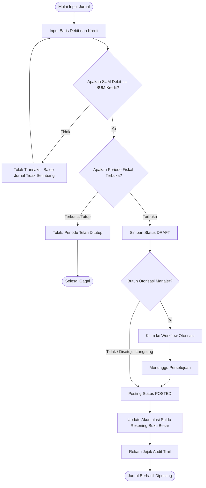
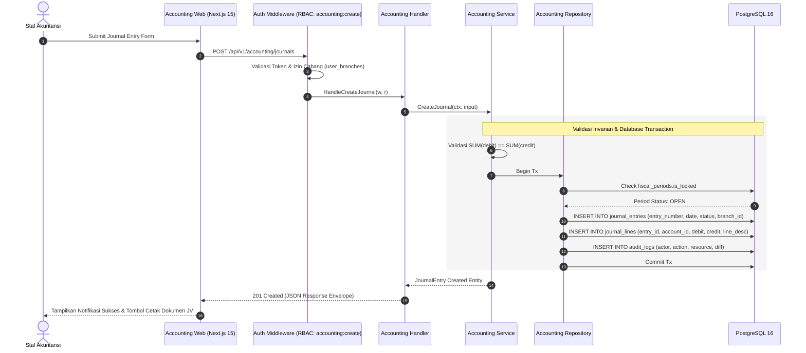
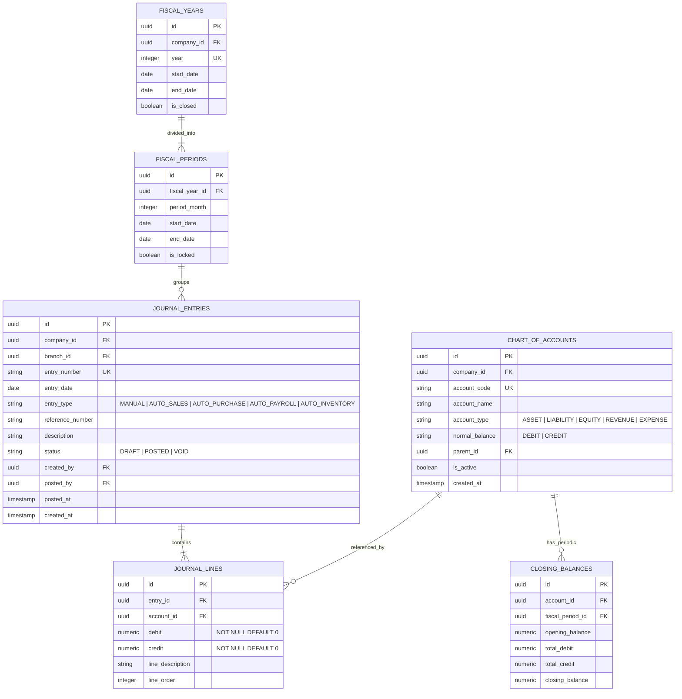

# 01. Software Design Document: Accounting & General Ledger

## 1. Ringkasan Modul & Tanggung Jawab
Modul **Accounting & General Ledger** bertanggung jawab atas pencatatan seluruh mutasi finansial perusahaan dengan prinsip *Double-Entry Bookkeeping*. Setiap transaksi keuangan wajib memenuhi invarian `SUM(debit) == SUM(credit)`.

- **Lokasi Backend**: `services/api/internal/modules/accounting/`
- **Lokasi Frontend**: `apps/web/app/(dashboard)/accounting/`

---

## 2. Use Case Diagram

---

## 3. Activity Diagram (Alur Posting Jurnal Umum)

---

## 4. Sequence Diagram (API Request & Response Lifecycle)

---

## 5. Entity Relationship Diagram (ERD)

