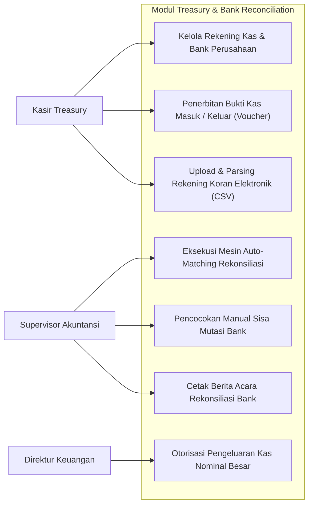
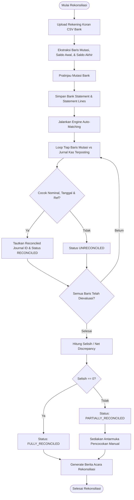
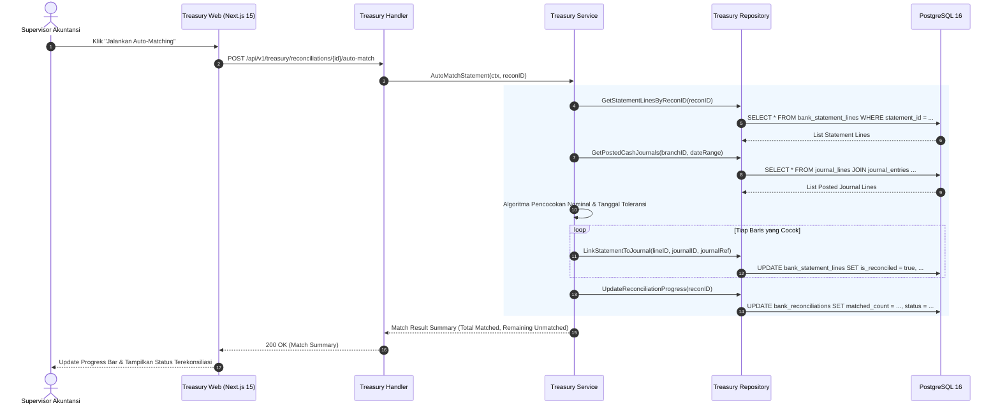
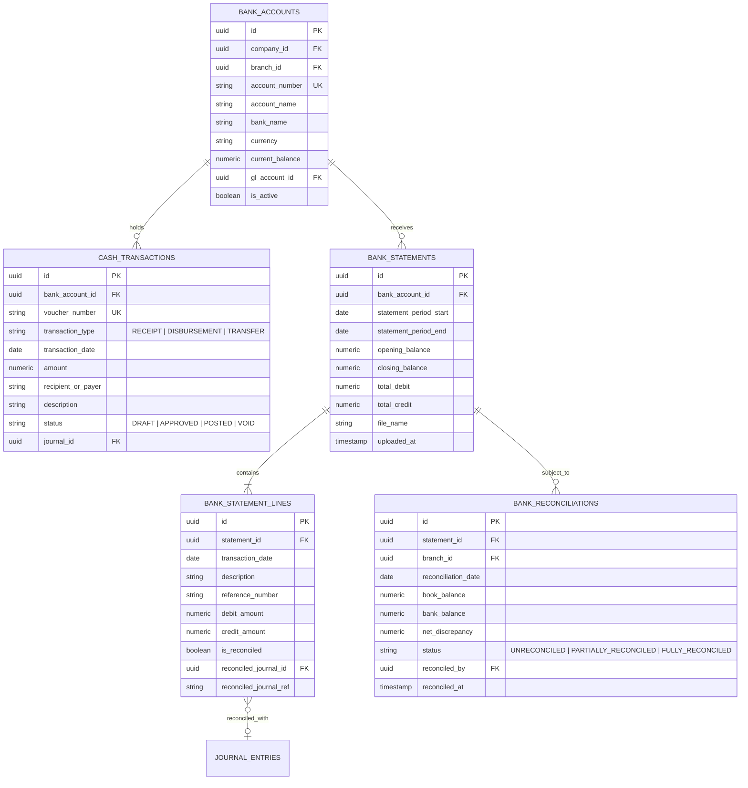

# 02. Software Design Document: Treasury & Bank Reconciliation

## 1. Ringkasan Modul & Tanggung Jawab
Modul **Treasury** mengelola rekening kas & bank perusahaan, penerimaan kas (*Cash Receipts*), pengeluaran kas (*Cash Disbursements*), impor mutasi rekening koran elektronik (BCA, Mandiri, BRI, BNI), serta mesin rekonsiliasi bank otomatis dengan jurnal umum.

- **Lokasi Backend**: `services/api/internal/modules/treasury/`
- **Lokasi Frontend**: `apps/web/app/(dashboard)/treasury/`

---

## 2. Use Case Diagram

---

## 3. Activity Diagram (Alur Rekonsiliasi Bank Otomatis)

---

## 4. Sequence Diagram (Auto-Matching Engine Execution)

---

## 5. Entity Relationship Diagram (ERD)

