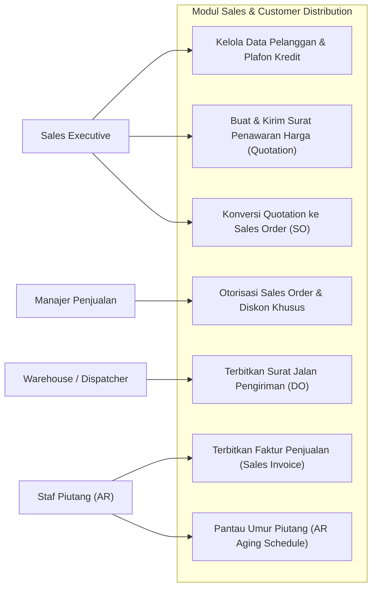
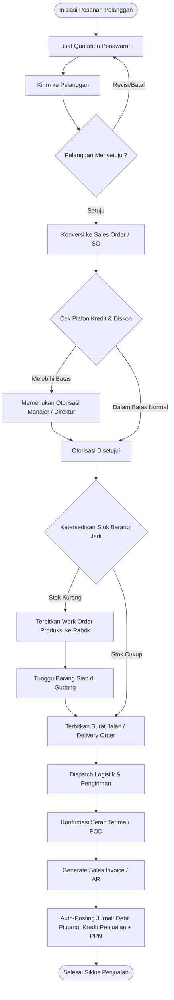
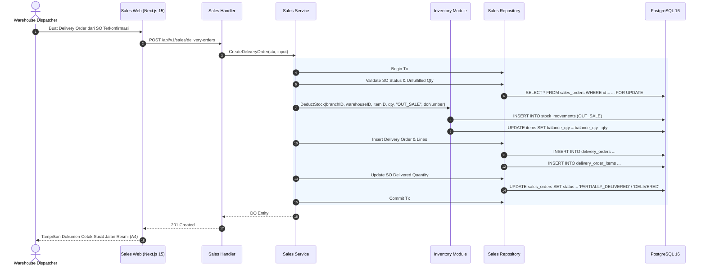
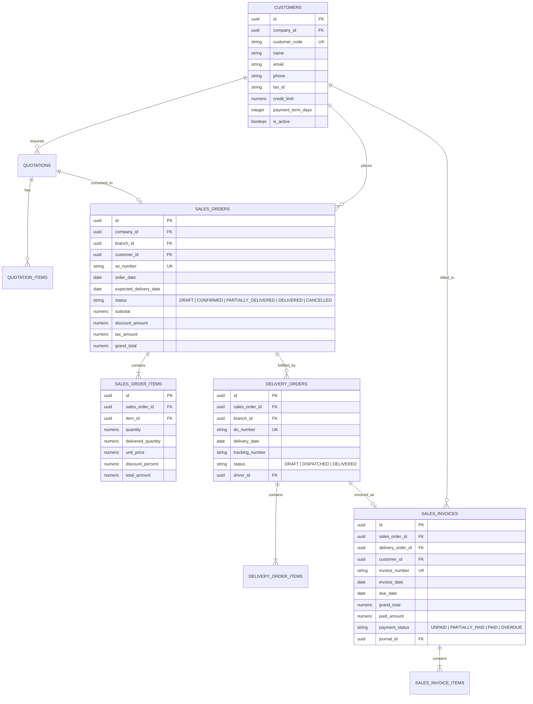

# 03. Software Design Document: Sales & Customer Distribution

## 1. Ringkasan Modul & Tanggung Jawab
Modul **Sales & Customer Distribution** mengelola siklus pendapatan (*Order-to-Cash*): Penawaran Harga Pelanggan (*Quotations*), Konfirmasi Pesanan (*Sales Orders*), Surat Jalan Pengiriman (*Delivery Orders*), Faktur Penjualan (*Sales Invoices*), dan Pelacakan Piutang Usaha (*AR Aging*).

- **Lokasi Backend**: `services/api/internal/modules/sales/`
- **Lokasi Frontend**: `apps/web/app/(dashboard)/sales/`

---

## 2. Use Case Diagram

---

## 3. Activity Diagram (Siklus Order-to-Cash)

---

## 4. Sequence Diagram (Penerbitan Delivery Order & Pengurangan Stok)

---

## 5. Entity Relationship Diagram (ERD)

