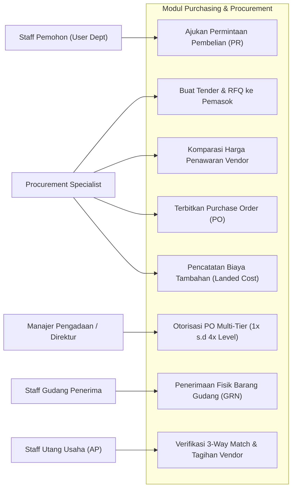
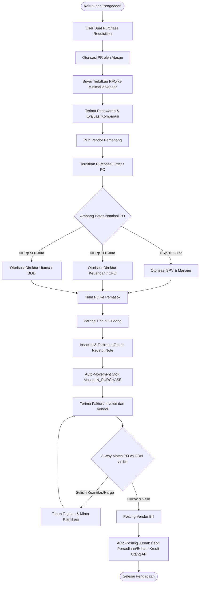
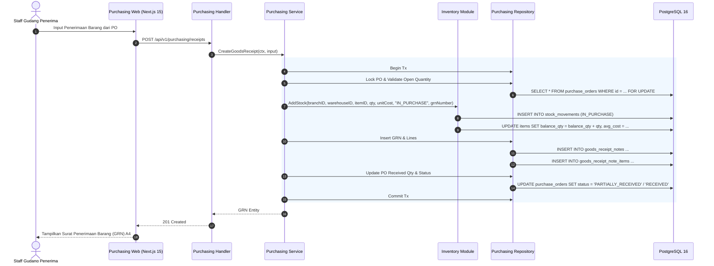
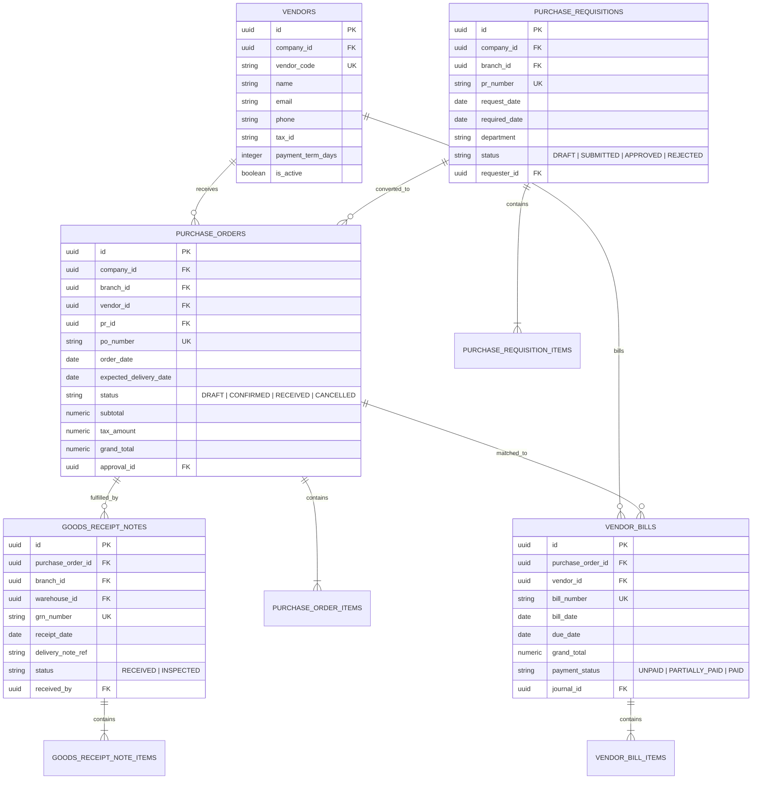

# 04. Software Design Document: Purchasing & Procurement

## 1. Ringkasan Modul & Tanggung Jawab
Modul **Purchasing & Procurement** mengendalikan siklus pengadaan barang & jasa (*Procure-to-Pay*): Permintaan Pembelian (*Purchase Requisition / PR*), Permintaan Penawaran Pemasok (*RFQ*), Pesanan Pembelian (*Purchase Order / PO*), Penerimaan Barang Gudang (*Goods Receipt Note / GRN*), Alokasi Biaya Tambahan (*Landed Cost*), dan Tagihan Pemasok (*Vendor Bills / AP*).

- **Lokasi Backend**: `services/api/internal/modules/purchasing/`
- **Lokasi Frontend**: `apps/web/app/(dashboard)/purchasing/`

---

## 2. Use Case Diagram

---

## 3. Activity Diagram (Siklus Procure-to-Pay & 3-Way Matching)

---

## 4. Sequence Diagram (Goods Receipt Note & Stock Valuation)

---

## 5. Entity Relationship Diagram (ERD)

