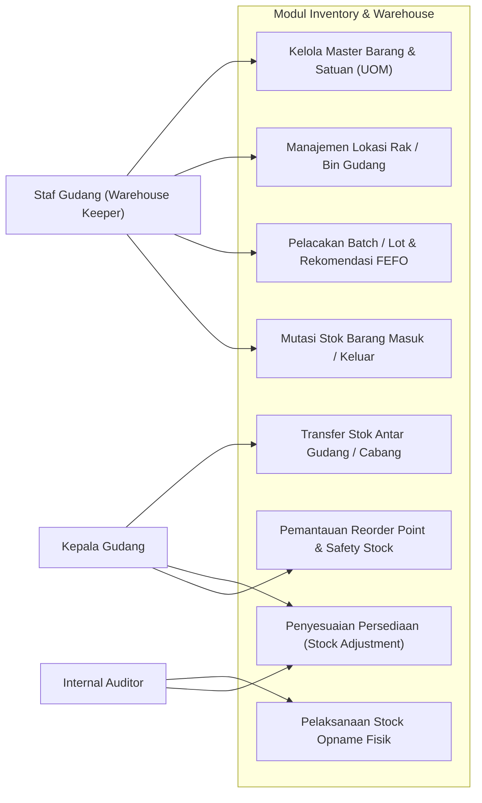
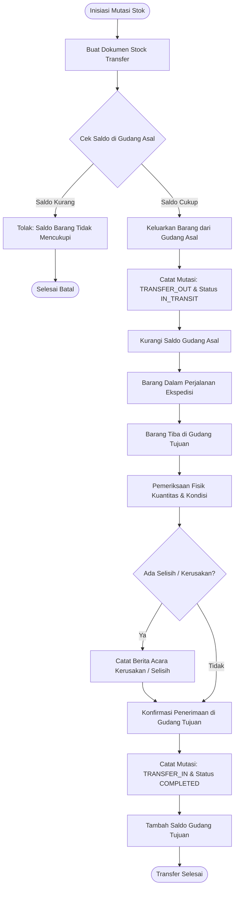
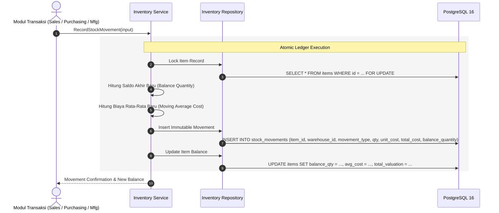
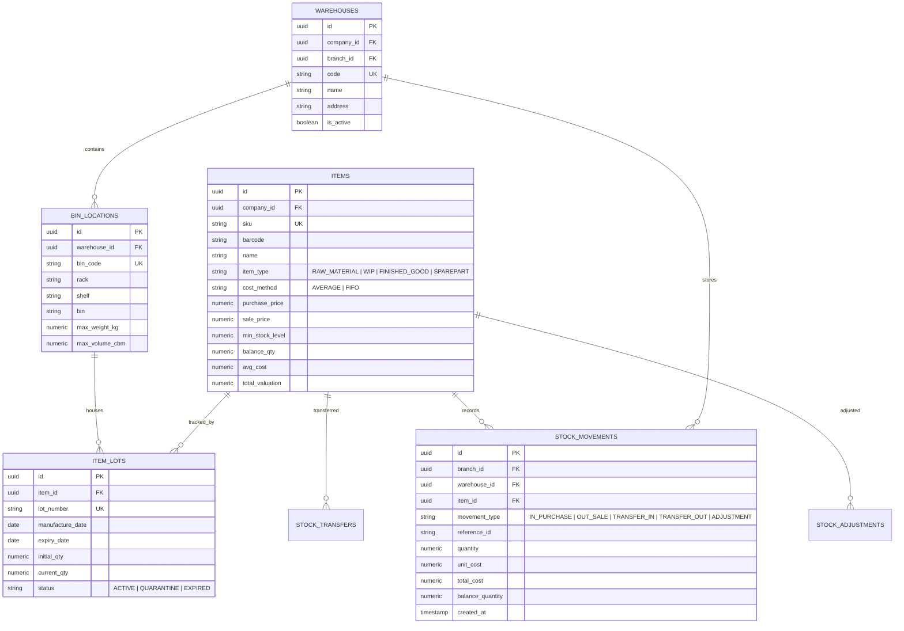

# 05. Software Design Document: Inventory & Warehouse Management

## 1. Ringkasan Modul & Tanggung Jawab
Modul **Inventory & Warehouse Management** mengelola pergerakan fisik dan valuasi persediaan (*Perpetual Inventory System*). Setiap mutasi stok (masuk, keluar, transfer, penyesuaian) wajib mencatat histori permanen yang tidak dapat diubah (*immutable ledger record*).

- **Lokasi Backend**: `services/api/internal/modules/inventory/`
- **Lokasi Frontend**: `apps/web/app/(dashboard)/inventory/`

---

## 2. Use Case Diagram

---

## 3. Activity Diagram (Transfer Stok Antar Gudang & Konfirmasi)

---

## 4. Sequence Diagram (Pencatatan Mutasi Stok Perpetual)

---

## 5. Entity Relationship Diagram (ERD)

