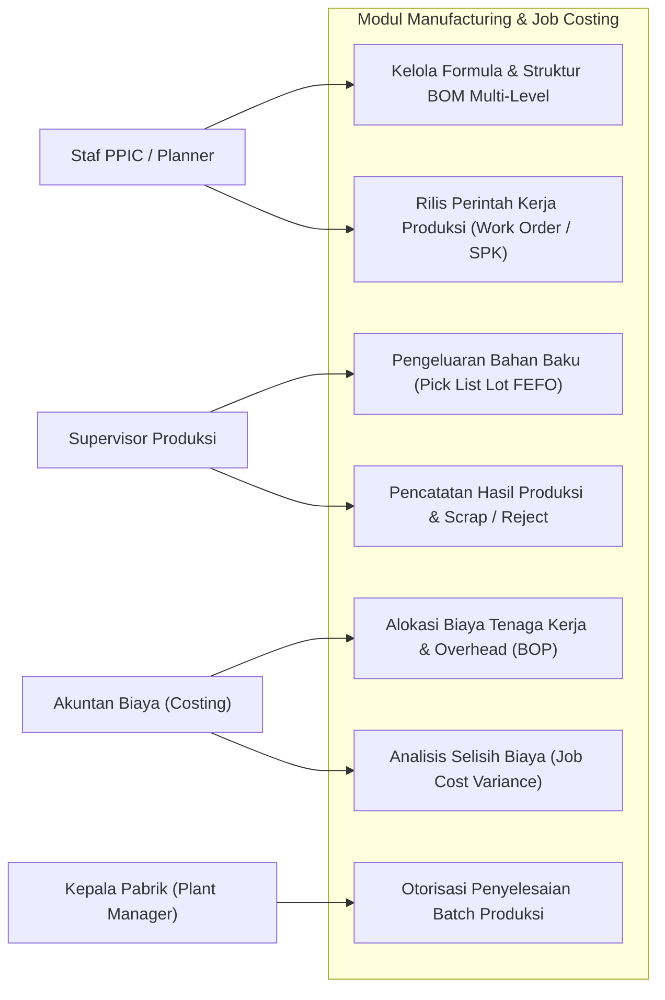
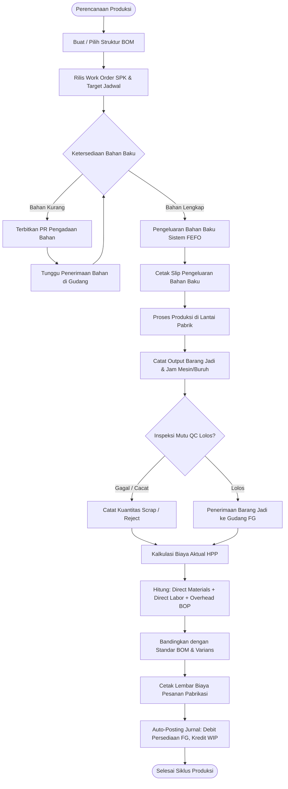
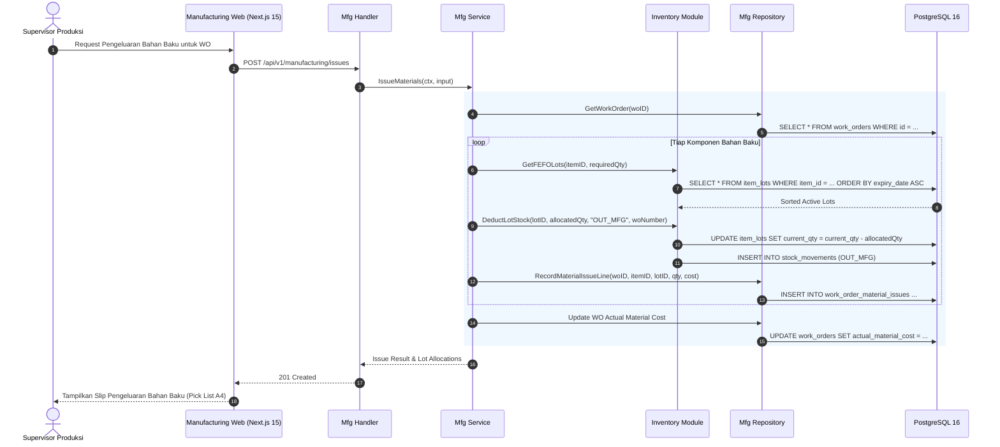
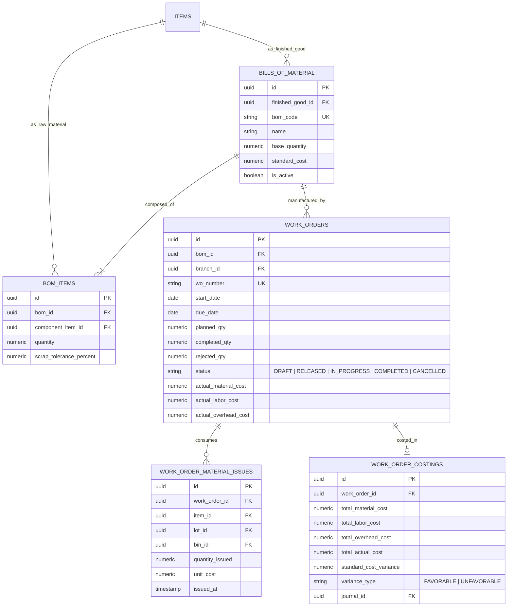

# 06. Software Design Document: Manufacturing Execution & Job Costing

## 1. Ringkasan Modul & Tanggung Jawab
Modul **Manufacturing Execution & Job Costing** mengelola alur pabrikasi: Struktur Bahan Baku (*Bill of Materials / BOM*), Surat Perintah Kerja (*Work Orders / SPK*), Pengeluaran Bahan Baku ke Lantai Produksi (*Material Issues / Pick List*) dengan metode FEFO (*First-Expired, First-Out*), serta Kalkulasi Biaya Pesanan Aktual (*Job Order Costing*).

- **Lokasi Backend**: `services/api/internal/modules/manufacturing/`
- **Lokasi Frontend**: `apps/web/app/(dashboard)/manufacturing/`

---

## 2. Use Case Diagram

---

## 3. Activity Diagram (Siklus Eksekusi Pabrikasi & Job Costing)

---

## 4. Sequence Diagram (Pengeluaran Bahan Baku & Rekomendasi FEFO)

---

## 5. Entity Relationship Diagram (ERD)

