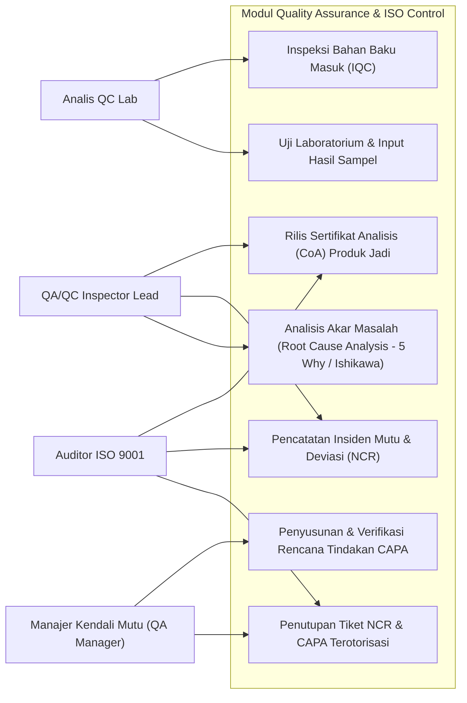
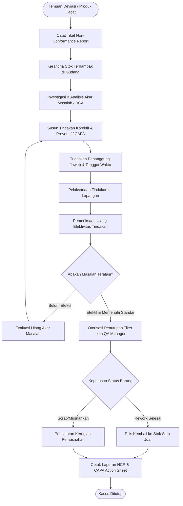
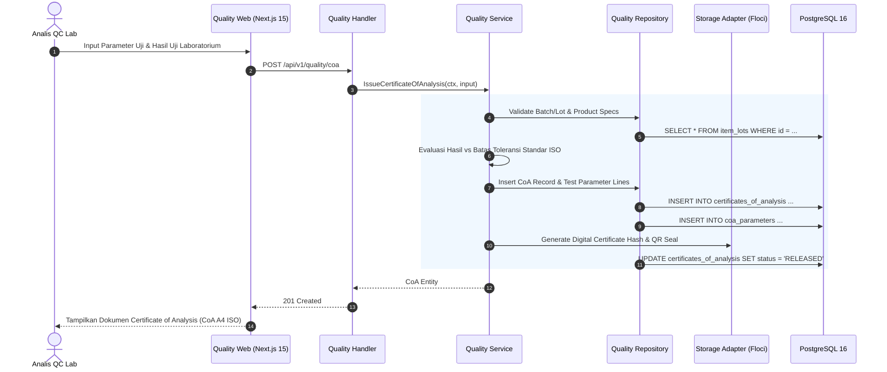
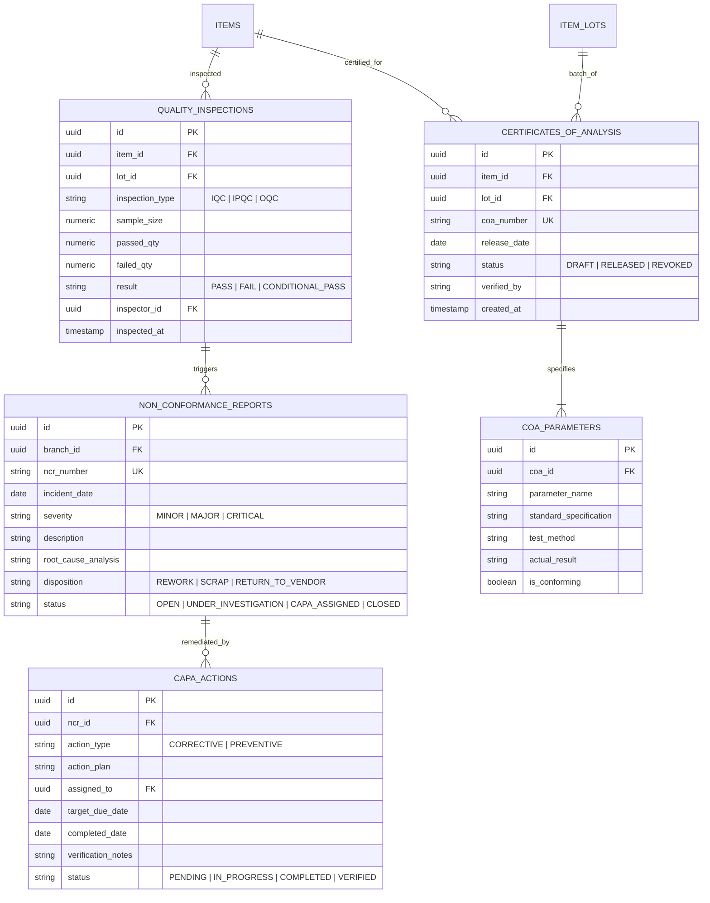

# 07. Software Design Document: Quality Assurance & ISO Control

## 1. Ringkasan Modul & Tanggung Jawab
Modul **Quality Assurance & Control** mengelola standar mutu ISO 9001:2015: Inspeksi Bahan Masuk (*Incoming Quality Control / IQC*), Penerbitan Sertifikat Analisis Laboratorium (*Certificate of Analysis / CoA*), serta Pelaporan Ketidaksesuaian Mutu (*Non-Conformance Report / NCR*) dan Siklus Tindakan Korektif-Preventif (*CAPA 8D*).

- **Lokasi Backend**: `services/api/internal/modules/quality/`
- **Lokasi Frontend**: `apps/web/app/(dashboard)/quality/`

---

## 2. Use Case Diagram

---

## 3. Activity Diagram (Siklus Penanganan Ketidaksesuaian Mutu NCR / CAPA)

---

## 4. Sequence Diagram (Penerbitan Certificate of Analysis / CoA)

---

## 5. Entity Relationship Diagram (ERD)

