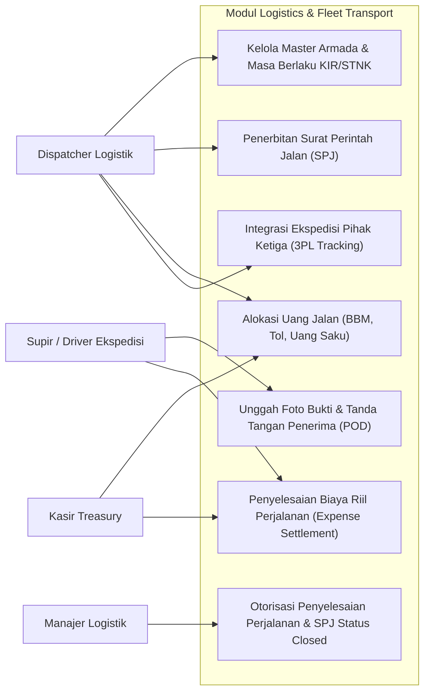
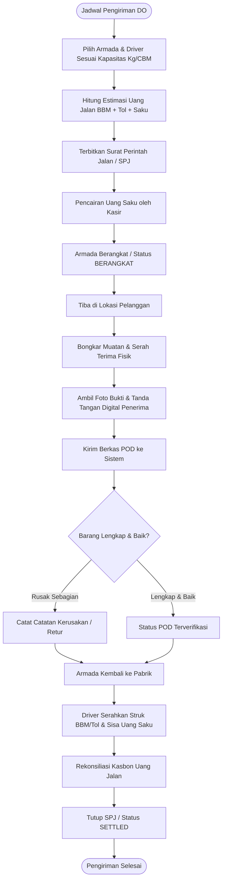
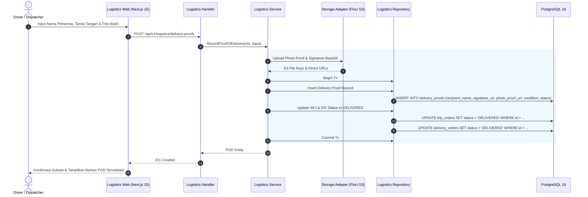
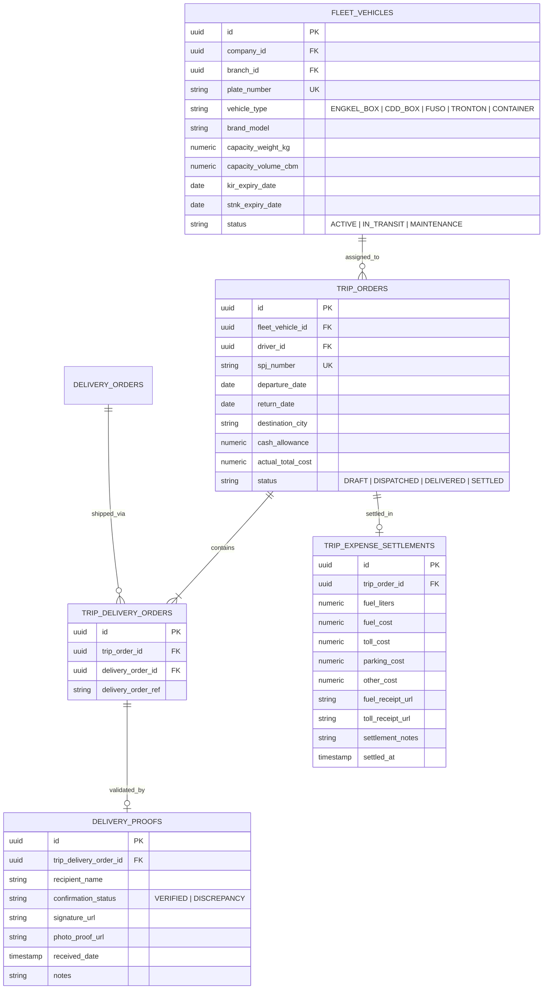

# 08. Software Design Document: Logistics & Fleet Transport

## 1. Ringkasan Modul & Tanggung Jawab
Modul **Logistics & Fleet Transport** mengelola armada transportasi dan distribusi fisik: Registrasi Armada Truk (*Fleet Vehicles*), Penerbitan Surat Perintah Jalan (*SPJ / Trip Orders*), Alokasi & Penyelesaian Uang Jalan Supir (*Driver Cash Allowance Settlement*), serta Validasi Bukti Pengiriman (*Proof of Delivery / POD*) dengan tanda tangan digital dan foto penerimaan.

- **Lokasi Backend**: `services/api/internal/modules/logistics/`
- **Lokasi Frontend**: `apps/web/app/(dashboard)/logistics/`

---

## 2. Use Case Diagram

---

## 3. Activity Diagram (Alur Pengiriman SPJ & Validasi POD)

---

## 4. Sequence Diagram (Unggah Proof of Delivery / POD)

---

## 5. Entity Relationship Diagram (ERD)

