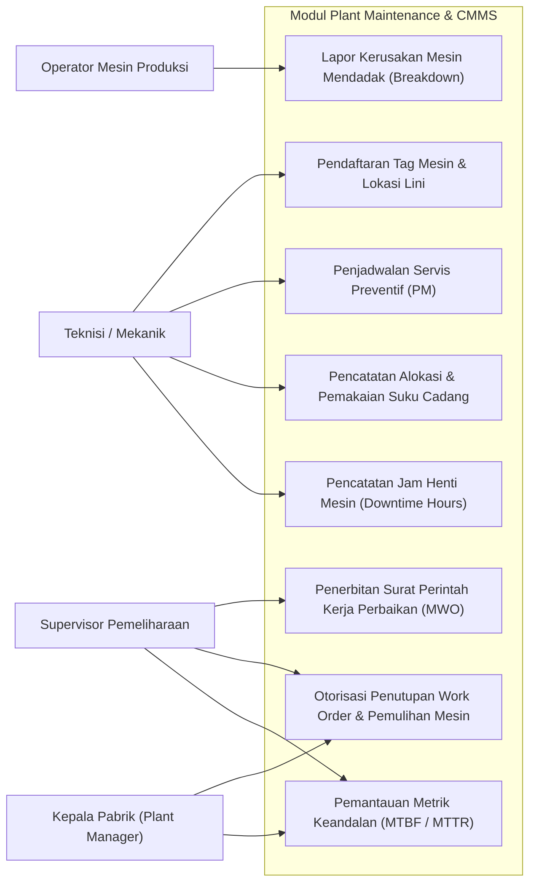
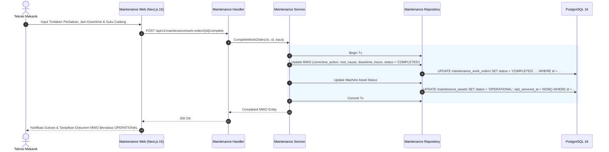
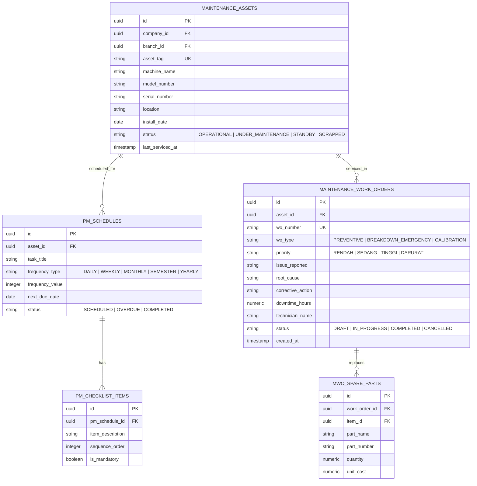

# 09. Software Design Document: Plant Maintenance & CMMS

## 1. Ringkasan Modul & Tanggung Jawab
Modul **Plant Maintenance & CMMS (Computerized Maintenance Management System)** mengelola keandalan mesin pabrik dan utilitas: Master Tag Aset Mesin (*Machine Assets*), Servis Terjadwal (*Preventive Maintenance / PM*), Penanganan Kerusakan Darurat (*Breakdown Work Orders / MWO*), Konsumsi Suku Cadang (*Spare Parts*), serta Analisis Keandalan (*MTBF / MTTR / Availability Rate*).

- **Lokasi Backend**: `services/api/internal/modules/maintenance/`
- **Lokasi Frontend**: `apps/web/app/(dashboard)/maintenance/`

---

## 2. Use Case Diagram



---

## 3. Activity Diagram (Siklus Penanganan Breakdown & Pemulihan Mesin)

```mermaid
flowchart TD
    Start([Insiden Kerusakan Mesin]) --> ReportFault[Operator Lapor Kerusakan di Lini]
    ReportFault --> CreateMWO[Sistem Terbitkan MWO Status DRAFT]
    CreateMWO --> AssignTech[Tugaskan Teknisi & Tentukan Prioritas TINGGI/DARURAT]
    
    AssignTech --> LockoutTagout[Pemasangan Safety LOTO / Karantina Mesin]
    LockoutTagout --> ChangeStatus[Ubah Status Mesin: DALAM_PERBAIKAN]
    
    ChangeStatus --> Diagnose[Teknisi Diagnosa Akar Masalah]
    Diagnose --> NeedParts{Butuh Ganti Suku Cadang?}
    
    NeedParts -- Ya --> RequestParts[Ambil Suku Cadang dari Gudang Spareparts]
    RequestParts --> RecordPartsUsage[Catat Konsumsi Part pada MWO]
    RecordPartsUsage --> RepairAction
    
    NeedParts -- Tidak --> RepairAction[Lakukan Perbaikan & Penyetelan Mekanikal/Elektrikal]
    
    RepairAction --> RunTest[Uji Coba Pengoperasian (Run-Test 30 Menit)]
    RunTest --> IsNormal{Mesin Beroperasi Normal?}
    
    IsNormal -- Belum Normal --> Diagnose
    IsNormal -- Normal --> RecordDowntime[Catat Total Jam Henti Lini / Downtime Hours]
    
    RecordDowntime --> CompleteMWO[Submit Penyelesaian MWO & Tindakan Korektif]
    CompleteMWO --> SpvVerify[Verifikasi oleh Supervisor Maintenance]
    SpvVerify --> CloseWO[Otorisasi Selesai / Status MESIN_BEROPERASI]
    CloseWO --> EndDone([Pemeliharaan Selesai])
```

---

## 4. Sequence Diagram (Penyelesaian Work Order & Pengembalian Status Operasional)



---

## 5. Entity Relationship Diagram (ERD)


