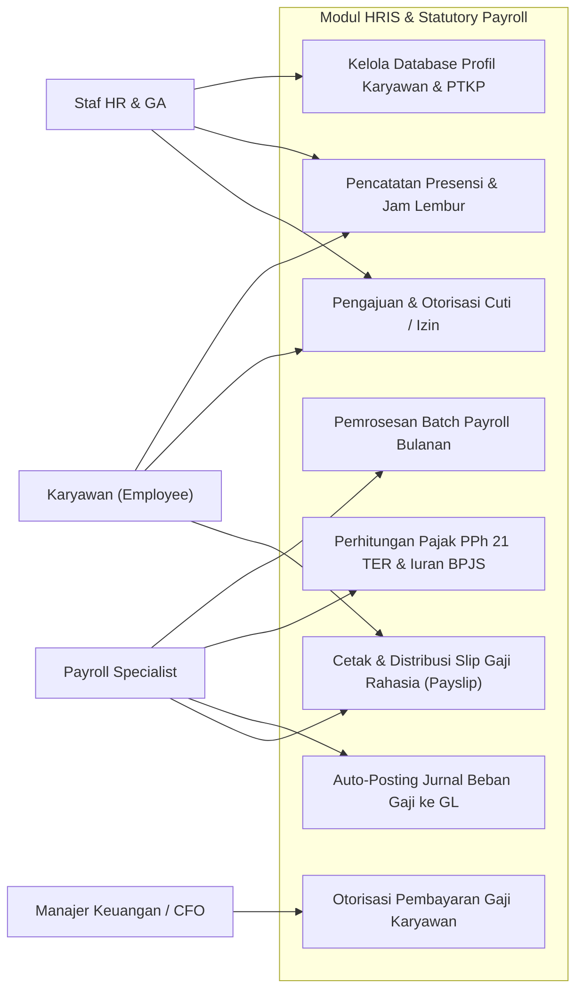
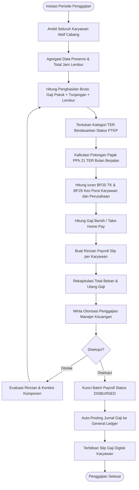
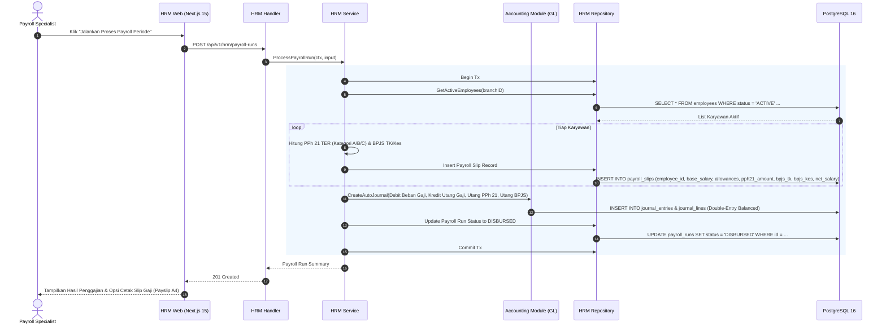
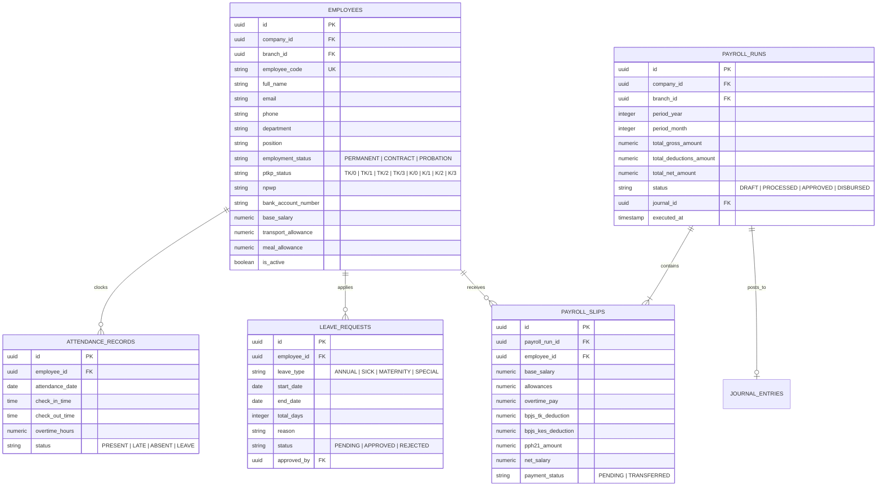

# 10. Software Design Document: HRIS & Indonesian Statutory Payroll

## 1. Ringkasan Modul & Tanggung Jawab
Modul **HRIS & Indonesian Statutory Payroll** mengelola siklus ketenagakerjaan dan penggajian sesuai regulasi Indonesia: Data Induk Karyawan (*Employee Profiles*), Presensi & Lembur (*Attendance & Overtime*), Permohonan Cuti (*Leaves*), Perhitungan Pajak PPh 21 Skema TER (*PP 58/2023 & PMK 168/2023*), Iuran BPJS Ketenagakerjaan & BPJS Kesehatan, *Auto-Posting* Jurnal Beban Gaji ke General Ledger, serta Penerbitan Slip Gaji Rahasia (*Confidential Payslips*).

- **Lokasi Backend**: `services/api/internal/modules/hrm/`
- **Lokasi Frontend**: `apps/web/app/(dashboard)/hrm/`

---

## 2. Use Case Diagram

---

## 3. Activity Diagram (Pemrosesan Batch Payroll & Pembukuan GL)

---

## 4. Sequence Diagram (Eksekusi Batch Payroll & Pembuatan Jurnal Gaji)

---

## 5. Entity Relationship Diagram (ERD)

