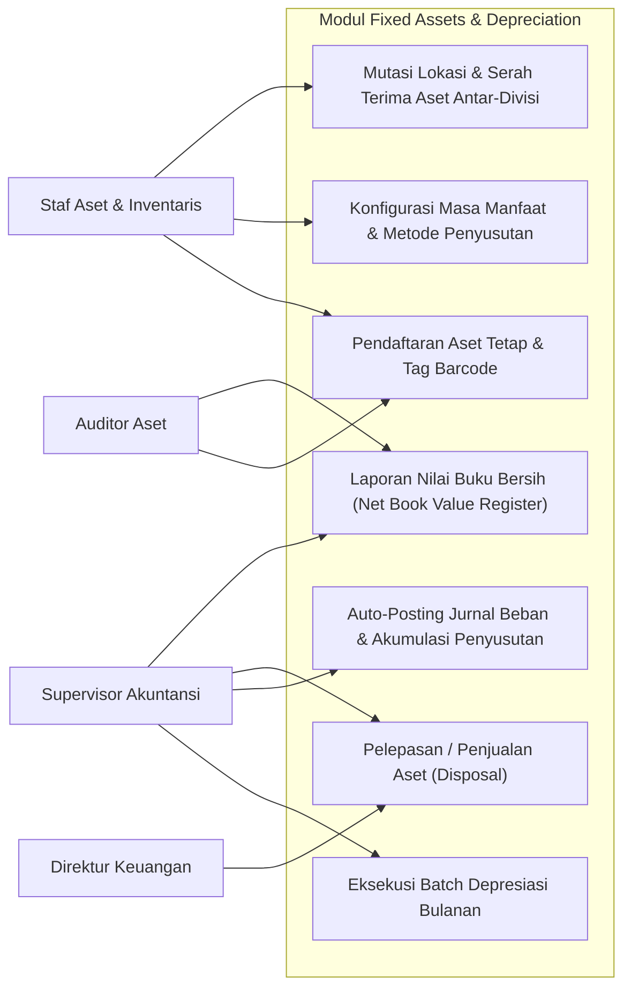
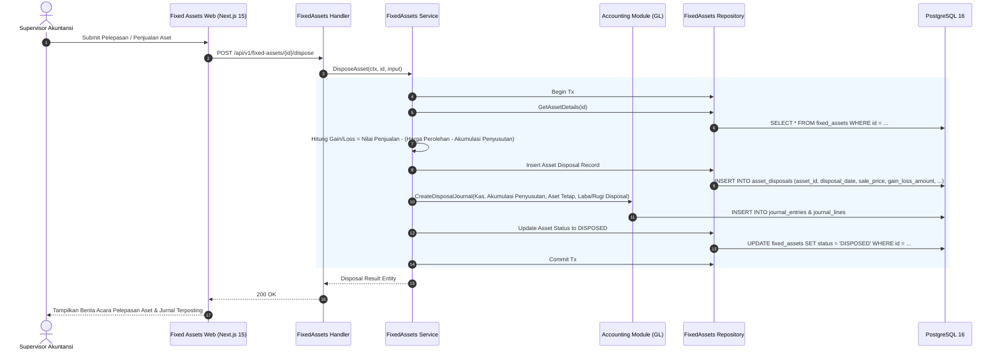
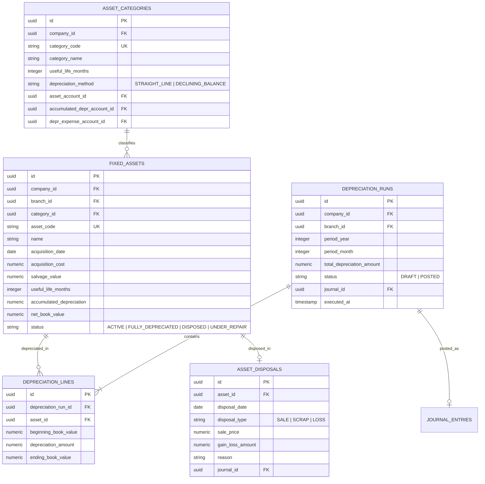

# 11. Software Design Document: Fixed Assets & Depreciation

## 1. Ringkasan Modul & Tanggung Jawab
Modul **Fixed Assets & Depreciation** mengelola aset berwujud perusahaan sesuai PSAK 16: Registrasi Aset Tetap (*Fixed Asset Registry*), Klasifikasi Kategori Fiskal, Eksekusi Penyusutan Bulanan Otomatis (*Depreciation Engine* - Garis Lurus / Saldo Menurun), Mutasi Lokasi/Departemen Aset, serta Pelepasan Aset (*Asset Disposal & Write-Off*) beserta perhitungan Laba/Rugi Pelepasan Aset.

- **Lokasi Backend**: `services/api/internal/modules/fixedassets/`
- **Lokasi Frontend**: `apps/web/app/(dashboard)/fixed-assets/`

---

## 2. Use Case Diagram



---

## 3. Activity Diagram (Eksekusi Batch Penyusutan Bulanan)

```mermaid
flowchart TD
    Start([Akhir Periode Bulan]) --> SelectPeriod[Pilih Periode Bulan & Tahun Penyusutan]
    SelectPeriod --> FetchAssets[Ambil Seluruh Aset Aktif yang Belum Habis Masa Manfaat]
    
    FetchAssets --> LoopAsset[Proses Kalkulasi Penyusutan per Aset]
    LoopAsset --> CheckMethod{Metode Penyusutan}
    
    CheckMethod -- Garis Lurus (Straight-Line) --> CalcSL[Depresiasi = (Harga Perolehan - Residu) / Bulan Masa Manfaat]
    CheckMethod -- Saldo Menurun (Declining) --> CalcDB[Depresiasi = Nilai Buku Awal * Tarif Saldo Menurun]
    
    CalcSL --> UpdateNBV[Hitung Nilai Buku Baru / Net Book Value]
    CalcDB --> UpdateNBV
    
    UpdateNBV --> SaveLine[Simpan Rincian Depreciation Line]
    SaveLine --> CheckRemaining{Masih Ada Aset Lain?}
    
    CheckRemaining -- Ya --> LoopAsset
    CheckRemaining -- Selesai --> SummarizeBatch[Akumulasi Total Beban Depresiasi Periode]
    
    SummarizeBatch --> CreateJournal[Auto-Posting Jurnal ke General Ledger]
    CreateJournal --> JournalPost[Debit: Beban Penyusutan, Kredit: Akumulasi Penyusutan]
    
    JournalPost --> UpdateAssetRecords[Perbarui Total Akumulasi Penyusutan Aset]
    UpdateAssetRecords --> EndDone([Penyusutan Selesai])
```

---

## 4. Sequence Diagram (Pelepasan Aset & Perhitungan Laba/Rugi)



---

## 5. Entity Relationship Diagram (ERD)


