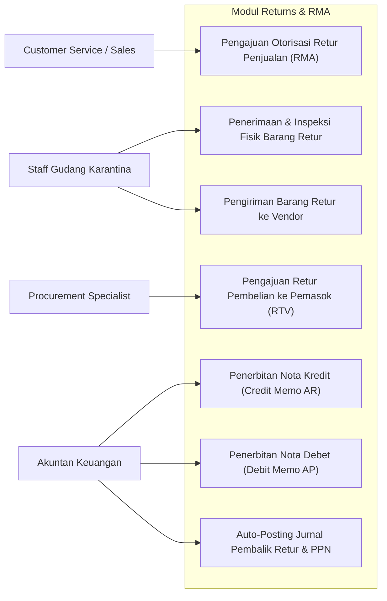
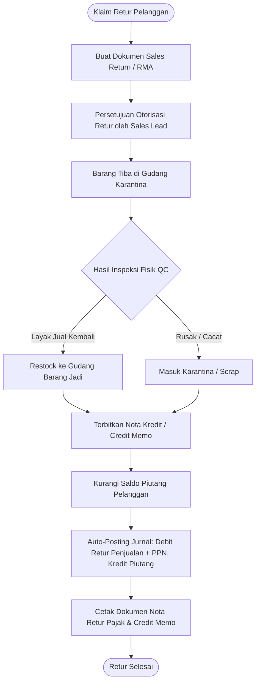
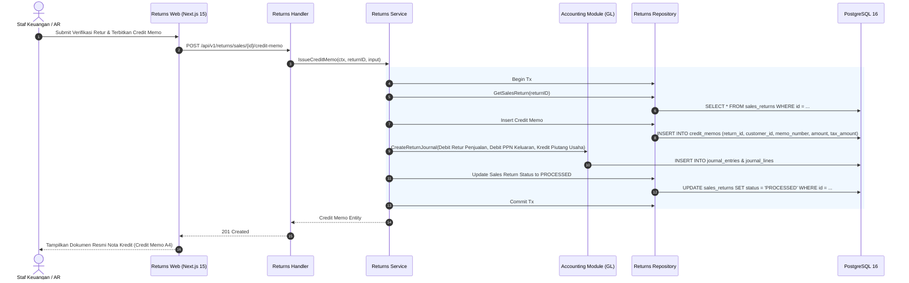
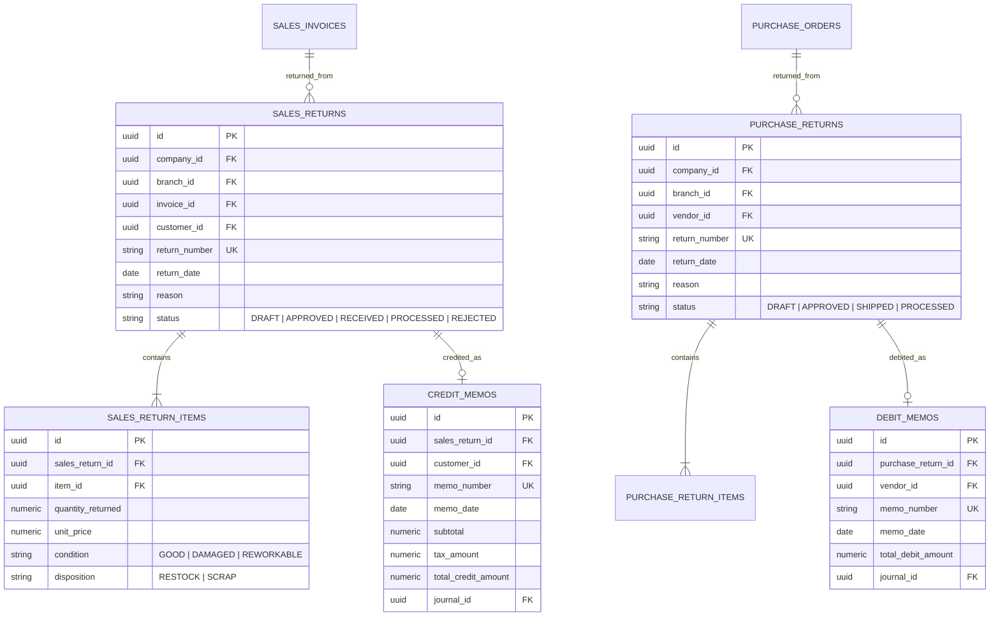

# 12. Software Design Document: Sales & Purchase Returns (RMA)

## 1. Ringkasan Modul & Tanggung Jawab
Modul **Returns & RMA** mengelola penanganan pengembalian barang dari pelanggan (*Sales Return / RMA*) dan pengembalian barang ke pemasok (*Purchase Return / RTV*): Otorisasi Retur, Penerimaan/Pengeluaran Fisik di Gudang Karantina, Penerbitan Nota Kredit (*Credit Memo - Piutang*) & Nota Debet (*Debit Memo - Utang*), serta Jurnal Pembalik Akuntansi Otomatis.

- **Lokasi Backend**: `services/api/internal/modules/returns/`
- **Lokasi Frontend**: `apps/web/app/(dashboard)/returns/`

---

## 2. Use Case Diagram

---

## 3. Activity Diagram (Alur Penanganan Retur Penjualan / RMA)

---

## 4. Sequence Diagram (Penerbitan Credit Memo & Penyesuaian Saldo Piutang)

---

## 5. Entity Relationship Diagram (ERD)

