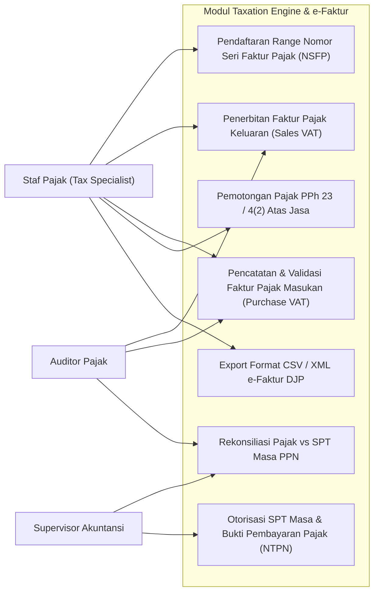
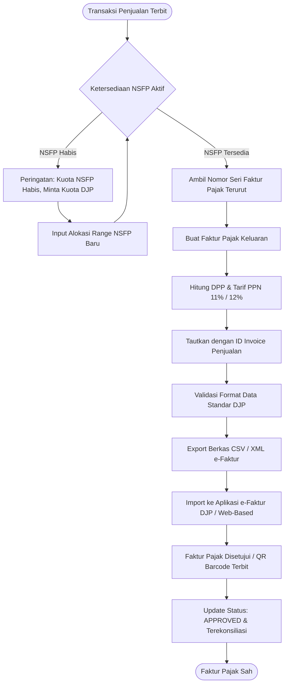
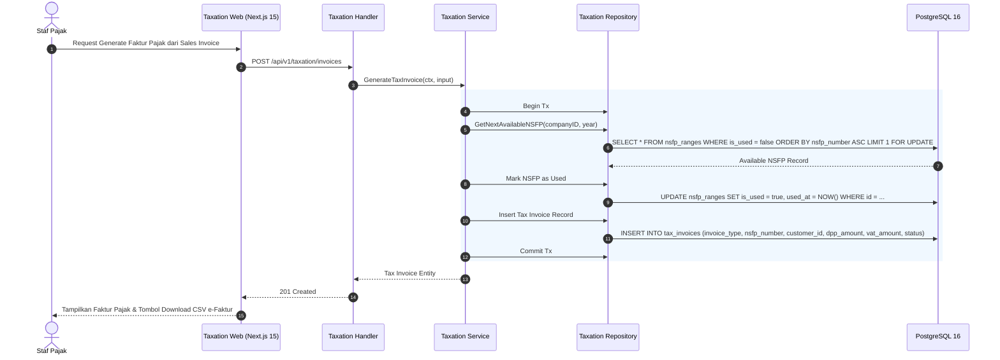
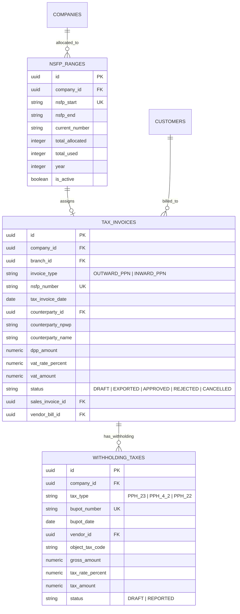

# 13. Software Design Document: Taxation Engine & e-Faktur

## 1. Ringkasan Modul & Tanggung Jawab
Modul **Taxation Engine** mengelola kepatuhan perpajakan Indonesia: Pajak Pertambahan Nilai (*PPN 11% / 12% & PPN WAPU*), Pajak Penghasilan Pasal 23 & 4(2) Final (*Withholding Tax*), Alokasi Nomor Seri Faktur Pajak (*NSFP*), serta Pembuatan Berkas Ekspor Standar DJP (*e-Faktur CSV/XML & Bukti Potong Unifikasi*).

- **Lokasi Backend**: `services/api/internal/modules/taxation/`
- **Lokasi Frontend**: `apps/web/app/(dashboard)/taxation/`

---

## 2. Use Case Diagram

---

## 3. Activity Diagram (Alur Penerbitan Faktur Pajak & Ekspor e-Faktur)

---

## 4. Sequence Diagram (Alokasi NSFP & Pembuatan Faktur Pajak)

---

## 5. Entity Relationship Diagram (ERD)

