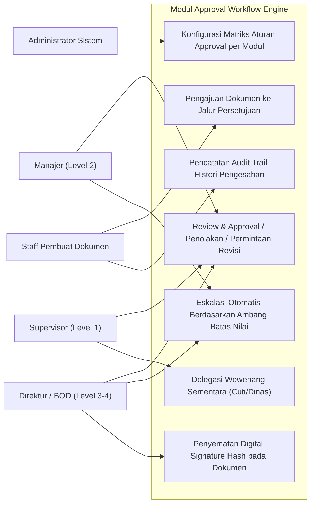
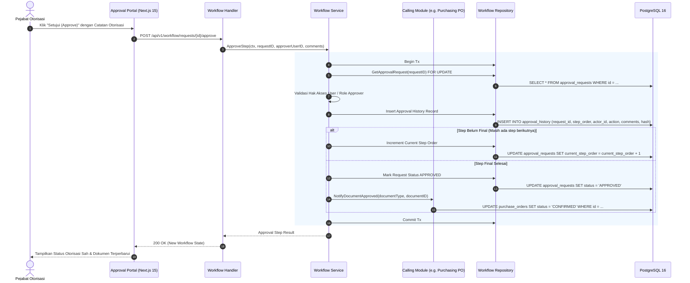
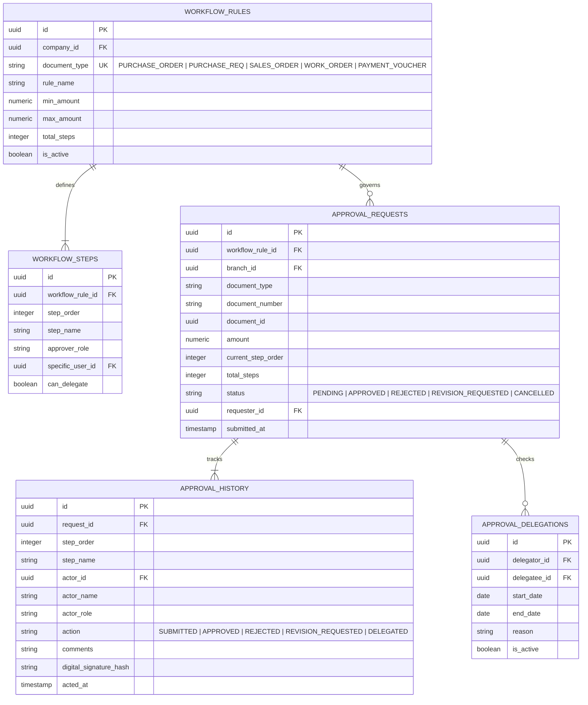

# 14. Software Design Document: Multi-Tier Approval Workflow Engine

## 1. Ringkasan Modul & Tanggung Jawab
Modul **Multi-Tier Approval Workflow Engine** adalah mesin orkestrasi persetujuan terpusat untuk seluruh dokumen bisnis (PO, PR, SO, MWO, Jurnal, Voucher, Cuti): Matriks Otorisasi Dinamis Berdasarkan Ambang Batas Nilai (*Threshold-Based Routing*), Pendelegasian Wewenang (*Delegation*), Pencatatan Histori Pengesahan (*Audit History Trail*), dan Integrasi Tanda Tangan Digital pada Dokumen Cetak Standar Industri.

- **Lokasi Backend**: `services/api/internal/modules/workflow/`
- **Lokasi Frontend**: `apps/web/app/(dashboard)/approvals/` & `components/shared/print-document/workflow-adapter.ts`

---

## 2. Use Case Diagram



---

## 3. Activity Diagram (Siklus Penilaian & Persetujuan Multi-Tier)

```mermaid
flowchart TD
    Start([Dokumen Bisnis Disubmit]) --> MatchRule[Cari Aturan Workflow Sesuai Tipe Dokumen & Nominal]
    MatchRule --> CalcTiers[Tentukan Jumlah Tingkat Otorisasi N Level]
    CalcTiers --> InitRequest[Inisialisasi Approval Request: Step 1 / N]
    
    InitRequest --> NotifyApprover[Kirim Notifikasi ke Approver Tingkat Saat Ini]
    NotifyApprover --> CheckDelegation{Ada Delegasi Aktif?}
    
    CheckDelegation -- Ya --> RouteDelegate[Alihkan ke Pejabat Pengganti yang Didelegasikan]
    CheckDelegation -- Tidak --> WaitAction[Tunggu Aksi Otorisator]
    
    RouteDelegate --> WaitAction
    WaitAction --> ApproverAction{Keputusan Approver}
    
    ApproverAction -- Minta Revisi --> MarkRevision[Status REVISION_REQUESTED]
    MarkRevision --> NotifyRequester[Kembalikan ke Pemohon untuk Diperbaiki]
    NotifyRequester --> EndFail([Revisi])
    
    ApproverAction -- Tolak (Reject) --> MarkRejected[Status REJECTED & Catat Alasan]
    MarkRejected --> LockDoc[Kunci Dokumen Bisnis Status Ditolak]
    LockDoc --> EndFail
    
    ApproverAction -- Setujui (Approve) --> RecordStep[Catat Histori Approval, Tanggal & Digital Hash]
    RecordStep --> IsFinalStep{Apakah Step Saat Ini == N (Final)?}
    
    IsFinalStep -- Belum --> NextStep[Naikkan Step Order: Current Step + 1]
    NextStep --> NotifyApprover
    
    IsFinalStep -- Ya (Final) --> MarkApproved[Status APPROVAL: APPROVED]
    MarkApproved --> UnlockDoc[Ubah Status Dokumen Bisnis: APPROVED / POSTED]
    UnlockDoc --> StampSignatures[Sematkan Bukti Pengesahan ke Dokumen Cetak]
    StampSignatures --> EndSuccess([Otorisasi Selesai Penuh])
```

---

## 4. Sequence Diagram (Eksekusi Approval Step oleh Pejabat Berwenang)



---

## 5. Entity Relationship Diagram (ERD)


