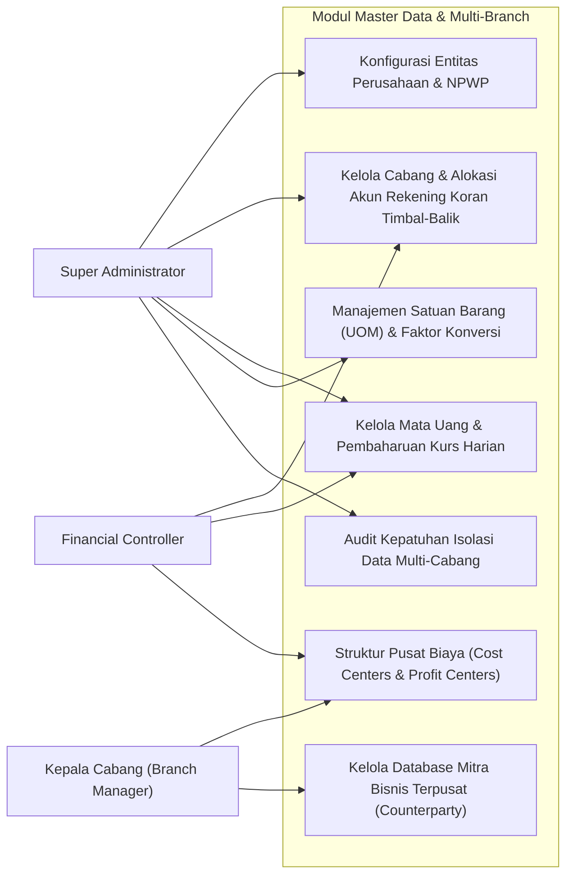
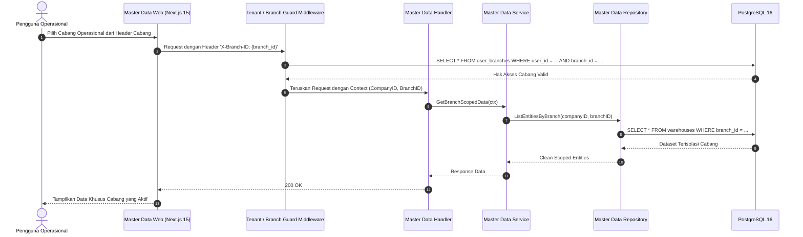
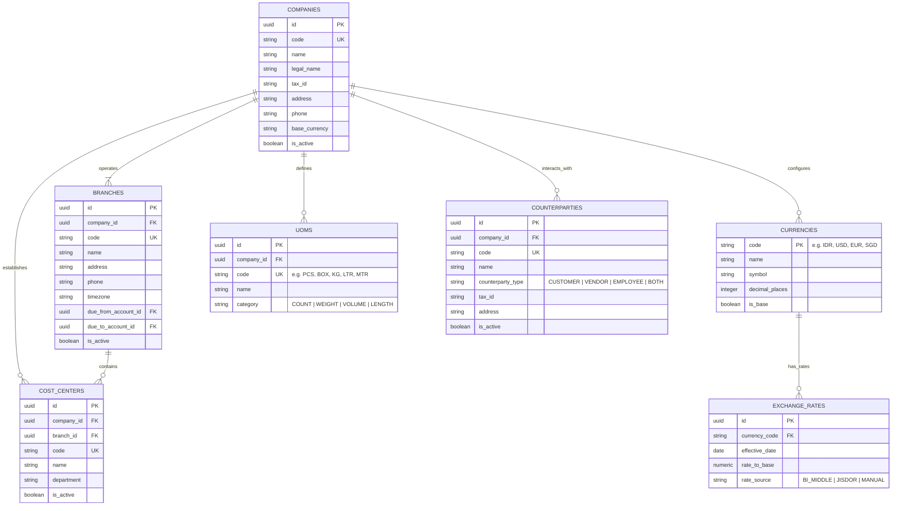

# 15. Software Design Document: Master Data & Multi-Branch Governance

## 1. Ringkasan Modul & Tanggung Jawab
Modul **Master Data & Multi-Branch Governance** mengelola fondasi organisasi perusahaan: Struktur Entitas Induk (*Companies*), Cabang Operasional (*Branches / Multi-Branch Governance* - PSAK 65 / IFRS 10), Mata Uang & Kurs (*Currencies & Exchange Rates*), Satuan Pengukuran (*UOM & Konversi*), Pusat Biaya (*Cost Centers*), serta Mitra Bisnis Terpadu (*Counterparties*).

- **Lokasi Backend**: `services/api/internal/modules/master/`
- **Lokasi Frontend**: `apps/web/app/(dashboard)/master-data/`

---

## 2. Use Case Diagram



---

## 3. Activity Diagram (Tata Kelola Multi-Cabang & Validasi Isolasi)

```mermaid
flowchart TD
    Start([Pengguna Mengakses Sistem]) --> AuthToken[Validasi Sesi Pengguna & Token JWT]
    AuthToken --> FetchBranches[Ambil Daftar Cabang yang Diizinkan dari user_branches]
    
    FetchBranches --> SelectBranch{Pilih Cabang Aktif (activeBranchId)}
    SelectBranch --> SetContext[Sematkan Tenant Context: Company ID & Branch ID]
    
    SetContext --> ExecQuery[Jalankan Transaksi / Kueri Data]
    ExecQuery --> FilterBranch[Tambahkan Filter Otomatis: WHERE branch_id = activeBranchId]
    
    FilterBranch --> IsInterBranch{Apakah Transaksi Antar-Cabang?}
    IsInterBranch -- Tidak --> CommitLocal[Simpan Data Mutasi Cabang Lokal]
    
    IsInterBranch -- Ya --> CreateReciprocal[Bentuk Pencatatan Rekening Koran Timbal-Balik]
    CreateReciprocal --> PostDueToDueFrom[Debit: Due From Branch B, Kredit: Due To Branch A]
    PostDueToDueFrom --> CommitLocal
    
    CommitLocal --> EndDone([Kueri Terisolasi Aman])
```

---

## 4. Sequence Diagram (Pengalihan Konteks Cabang & Isolasi Kueri)



---

## 5. Entity Relationship Diagram (ERD)


