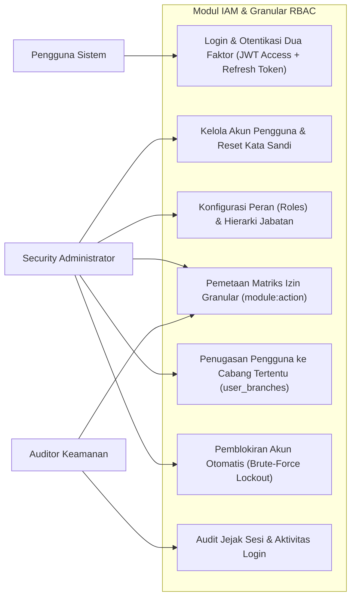
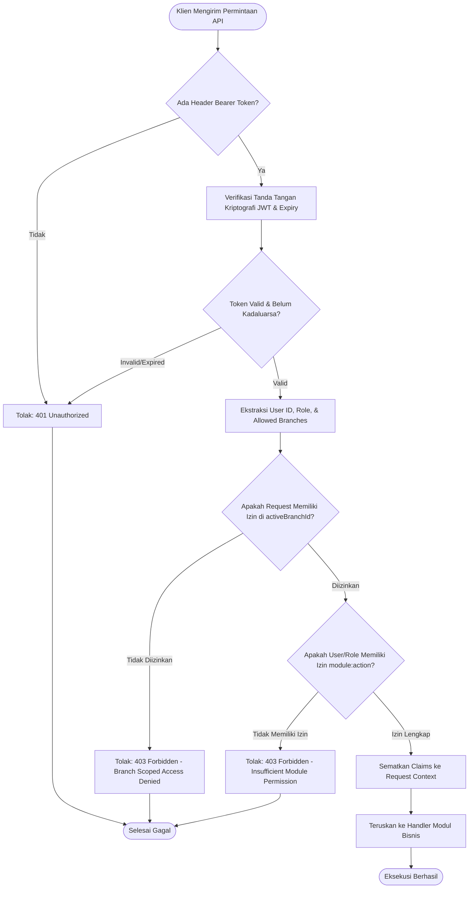
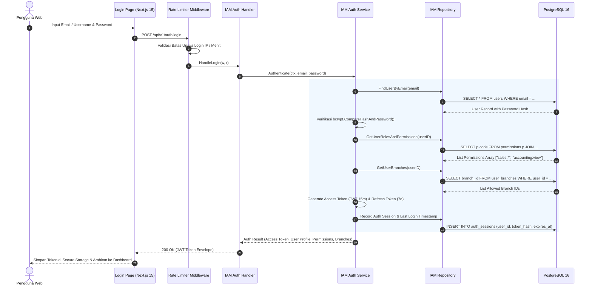
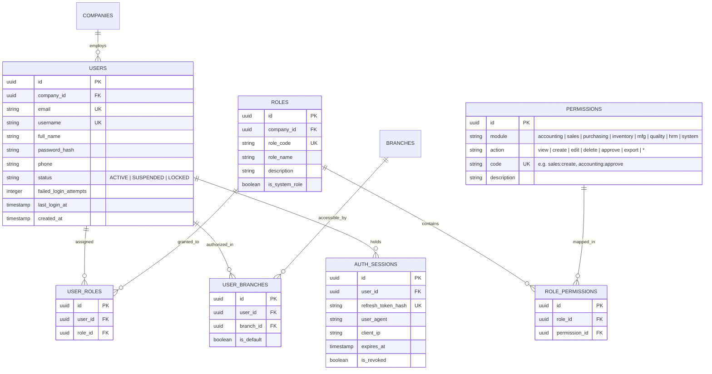

# 16. Software Design Document: IAM & Granular RBAC Matrix

## 1. Ringkasan Modul & Tanggung Jawab
Modul **Identity & Access Management (IAM) & Granular RBAC Matrix** bertanggung jawab atas keamanan akses sistem: Otentikasi Berbasis JWT (*JSON Web Tokens*), Hashing Kata Sandi (*bcrypt*), Matriks Izin Granular Modul-Aksi (`module:action`), Penugasan Cabang Pengguna (*User Branch Governance*), dan Pembatasan Laju Kueri (*Rate Limiting*).

- **Lokasi Backend**: `services/api/internal/modules/iam/`
- **Lokasi Frontend**: `apps/web/app/(auth)/login/` & `apps/web/app/(dashboard)/settings/iam/`

---

## 2. Use Case Diagram

---

## 3. Activity Diagram (Otentikasi JWT & Verifikasi Otorisasi Granular)

---

## 4. Sequence Diagram (Alur Login & Pembuatan Token Sesi)

---

## 5. Entity Relationship Diagram (ERD)

