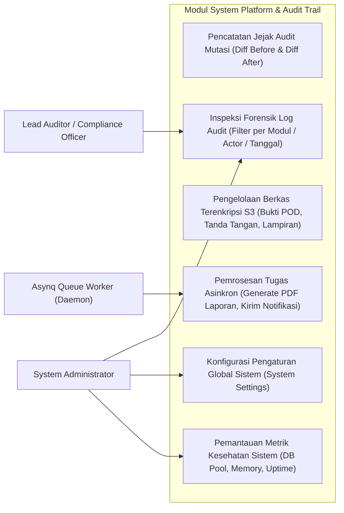
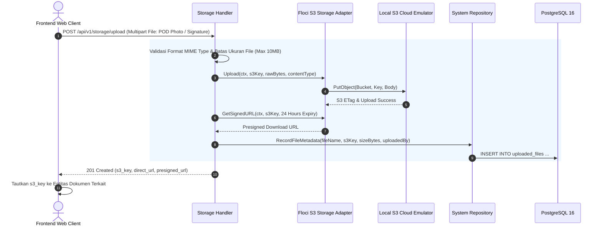
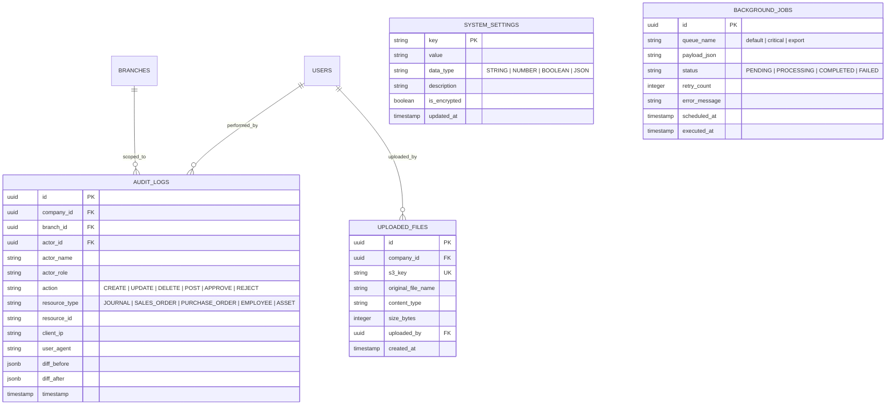

# 17. Software Design Document: System Platform, Storage & Audit Trail

## 1. Ringkasan Modul & Tanggung Jawab
Modul **System Platform & Audit Trail** mengelola fondasi infrastruktur perangkat lunak: Jejak Audit Forensik (*Immutable Audit Trail Diff Logger*), Pengantrian Tugas Asinkron (*Valkey / Asynq Background Queue*), Penyimpanan Berkas Berbasis S3 (*Floci Cloud Emulator Adapter*), Pengaturan Global Sistem (*System Settings*), dan Pemeriksaan Kesehatan Server (*Telemetry & Health Checks*).

- **Lokasi Backend**: `services/api/internal/platform/` & `services/api/internal/modules/system/`
- **Lokasi Frontend**: `apps/web/app/(dashboard)/settings/audit/`

---

## 2. Use Case Diagram



---

## 3. Activity Diagram (Perekaman Jejak Audit Otomatis pada Mutasi Data)

```mermaid
flowchart TD
    Start([Eksekusi Mutasi API / CUD]) --> BeginTx[Buka Transaksi Database ACID]
    BeginTx --> FetchOld[SELECT Snapshot Data Lama / diff_before]
    FetchOld --> ApplyMutation[Eksekusi INSERT / UPDATE / DELETE Entitas]
    
    ApplyMutation --> GenerateDiff[Bandingkan State Lama vs State Baru / JSON Diff]
    GenerateDiff --> CaptureContext[Ambil Konteks: User ID, Branch ID, Client IP, Resource Type]
    
    CaptureContext --> InsertAudit[INSERT INTO audit_logs (Immutable Record)]
    InsertAudit --> CommitTx[Commit Transaksi Database]
    
    CommitTx --> IsAsyncJobNeeded{Apakah Perlu Background Task?}
    IsAsyncJobNeeded -- Ya --> EnqueueAsynq[Kirim Tugas ke Queue Valkey / Asynq]
    IsAsyncJobNeeded -- Tidak --> ReturnAPI
    
    EnqueueAsynq --> ReturnAPI[Kembalikan Respon Sukses ke Klien]
    ReturnAPI --> EndDone([Mutasi & Audit Selesai])
```

---

## 4. Sequence Diagram (Penyimpanan Berkas ke Floci S3 & Pengambilan Presigned URL)



---

## 5. Entity Relationship Diagram (ERD)


