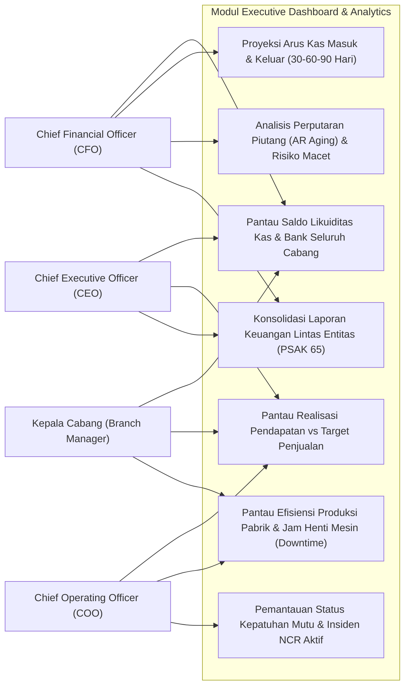
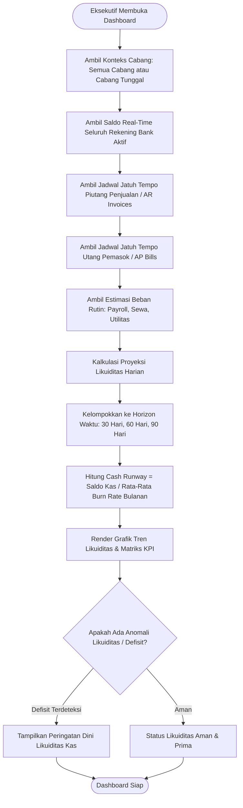
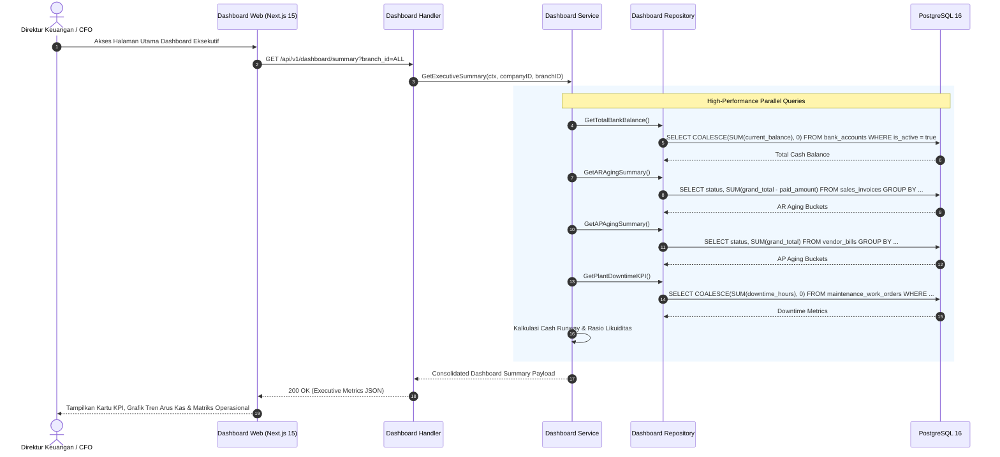
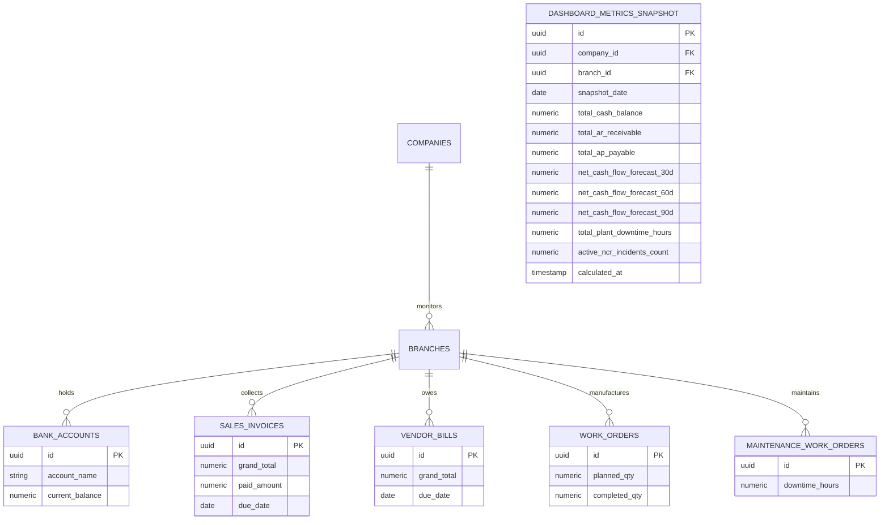

# 18. Software Design Document: Executive Dashboard & Analytics

## 1. Ringkasan Modul & Tanggung Jawab
Modul **Executive Dashboard & Analytics** menyediakan ringkasan analitik tingkat dewan direksi (*C-Level Decision Support System*): Proyeksi Arus Kas & *Cash Runway* (30-60-90 Hari), Saldo Likuiditas Bank Terkonsolidasi, Saldo Piutang (*AR Aging*) vs Utang (*AP Aging*), Kinerja Saluran Penjualan (*Sales Pipeline*), Tingkat Utilisasi Pabrik (*OEE & Downtime*), dan Kepatuhan Tata Kelola Mutu ISO.

- **Lokasi Backend**: `services/api/internal/modules/dashboard/`
- **Lokasi Frontend**: `apps/web/app/(dashboard)/page.tsx`

---

## 2. Use Case Diagram

---

## 3. Activity Diagram (Agregasi Data Finansial & Proyeksi Arus Kas)

---

## 4. Sequence Diagram (Kueri Agregasi Real-Time Executive KPI)

---

## 5. Entity Relationship Diagram (ERD & Keterikatan Data Agregasi)

